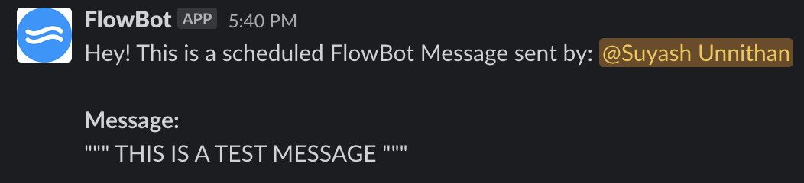

# FlowBot
Being in a state of flow is generally described as keeping your full focus and attention on completing one task. Distractions such as social media and notifications can cause people to break their state of flow as it causes them to divert their attention away from the task at hand. Slack Bot is a chat bot service which prevents you from breaking your co-worker's "flow" state by scheduling the message that you wanted to send to them for a later time.

## Installation

Clone the repo. In your terminal run:

```bash
npm install
```

## Run Server

Create a .env file and fill it out as such:

```bash
TOKEN= #Enter Classic Slack Bot Token
```

In the terminal, you can now the start the node server using:


```bash
npm start
```

## Commands
`!start` - FlowBot will start messaging process

`!restart` - FlowBot will restart messaging process

`!end` - FlowBot will end your current session (only to be used when a FlowBot session has started)

`!help` - FlowBot will tell you how to use its features

## Demo




