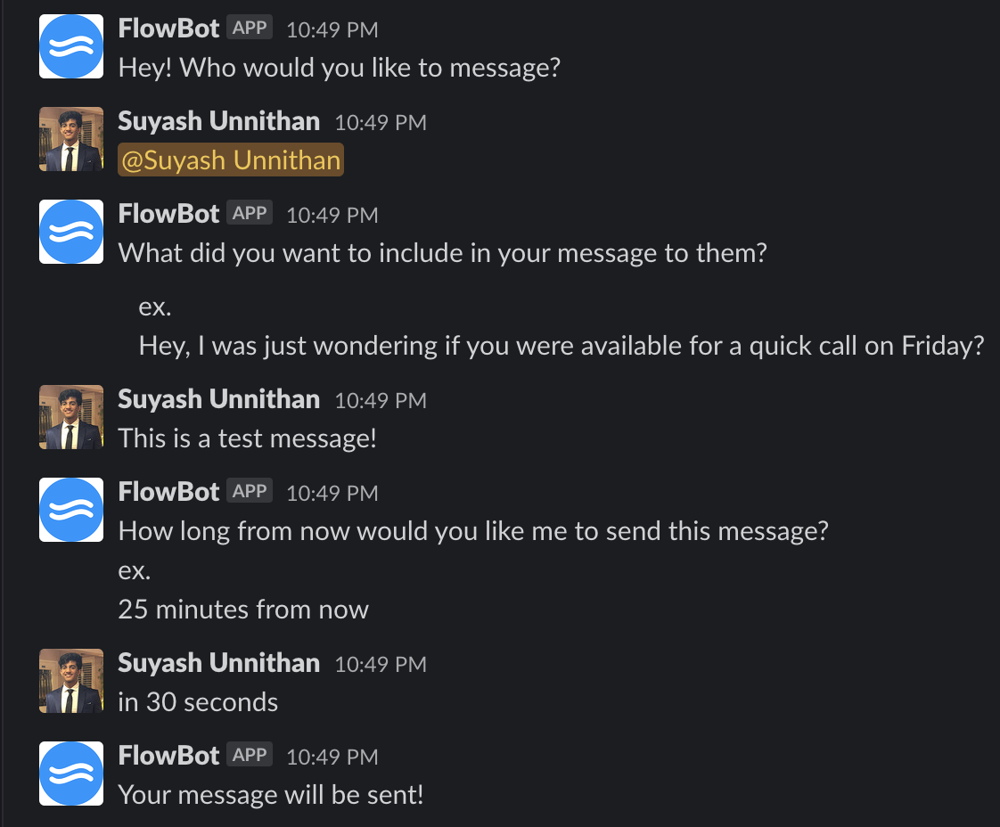
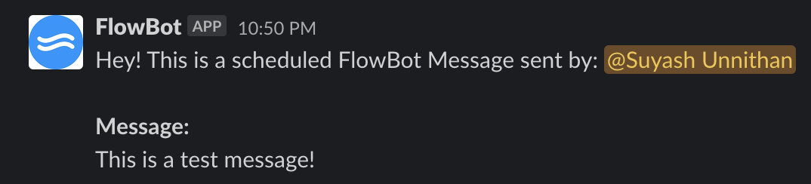

# FlowBot
Slack Bot which prevents you from breaking your co-worker's "flow" state by scheduling your messages to be sent at a later time.

## Installation

Clone the repo. In your terminal run:

```bash
npm install
```

## Run Server

Create a .env file and fill it out as such:

```bash
TOKEN= #Enter Classic Slack Bot Token
```

In the terminal, you can now the start the node server using:


```bash
npm start
```

## Commands
`!start` - FlowBot will start messaging process

`!restart` - FlowBot will restart messaging process

`!help` - FlowBot will tell you how to use its features

## Demo




